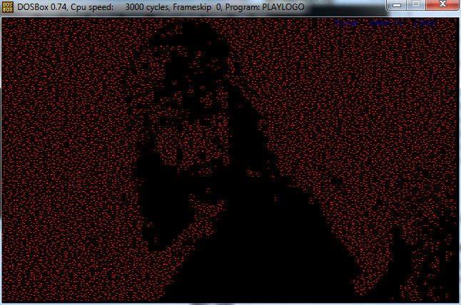
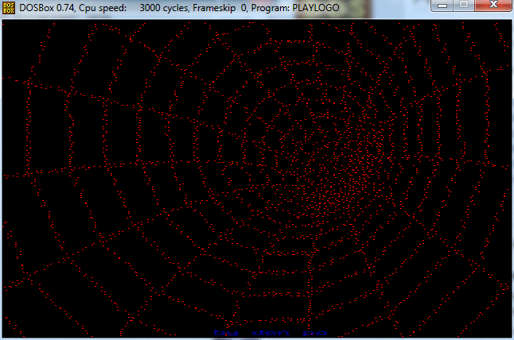
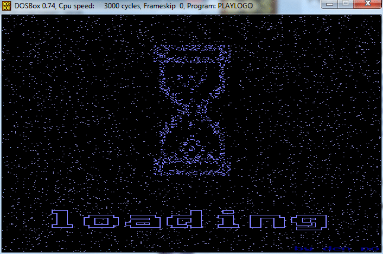
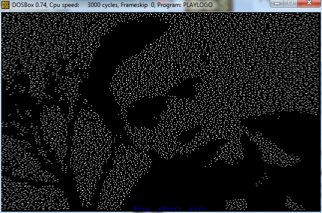

# Windows 9x boot screens

Here are a few boot screens and simple player I made in 2004.

Quote from [Wikipedia](https://en.wikipedia.org/wiki/LOGO.SYS):

> For LOGO.SYS or the equivalent embedded image in IO.SYS, Windows will also animate the image's color information using palette rotation; the image is static, but may have the illusion of movement as colors are changed.

